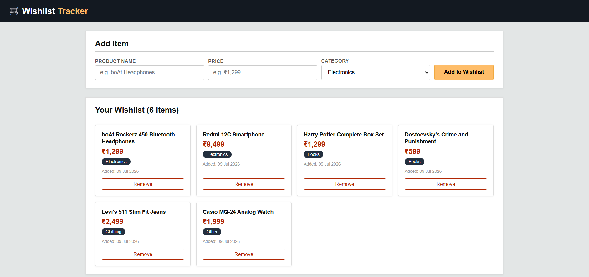

# Wishlist Tracker

A simple full-stack web app to add, view, and remove wishlist items — built with Flask, SQLAlchemy, and vanilla JavaScript.

## Screenshot



## Features

- Add items with name, price, and category
- View all items in a responsive card grid
- Remove items instantly
- Data persisted in SQLite via SQLAlchemy
- Frontend fetches data live from a JSON API (`/api/wishlist`) using vanilla JS `fetch()`

## Tech Stack

- **Backend:** Flask, Flask-SQLAlchemy
- **Database:** SQLite
- **Frontend:** HTML, CSS, vanilla JavaScript

## Project Structure

```
wishlist-tracker/
├── static/
│   ├── main.js
│   └── style.css
├── templates/
│   └── index.html
├── app.py
├── requirements.txt
└── .gitignore
```
